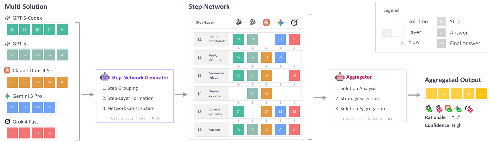
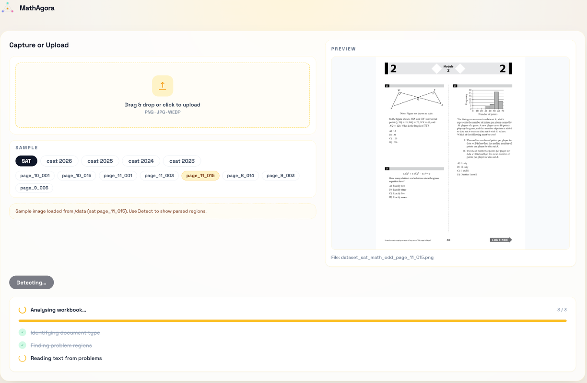
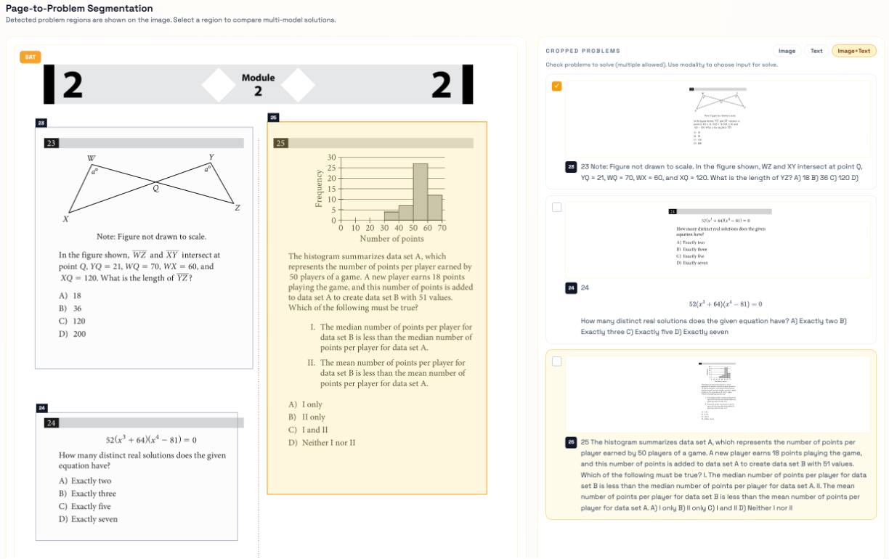
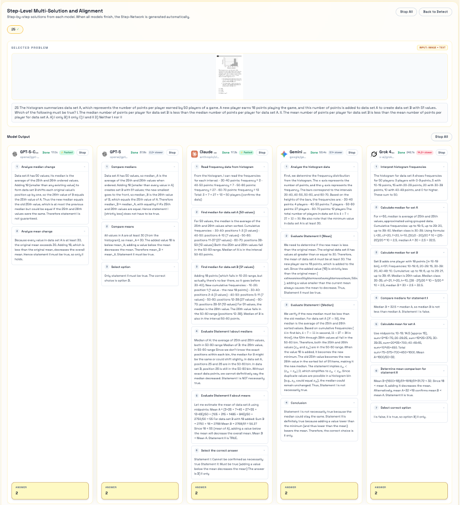
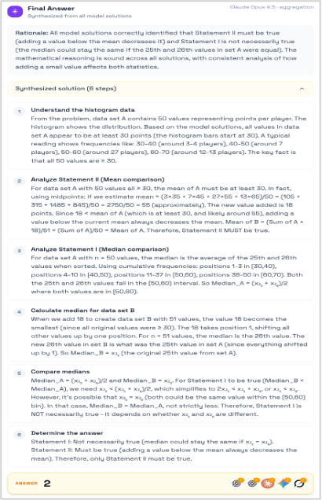

# MathAgora

**Live Demo:** [https://isoft.cnu.ac.kr/csat_acl2026demo/](https://isoft.cnu.ac.kr/csat_acl2026demo/)

MathAgora is a multi-model math reasoning platform. Upload an exam sheet or select a preloaded dataset sample, and MathAgora automatically detects individual problem regions, extracts text via OCR, and generates solutions simultaneously from five large language models — enabling step-level comparison, structured reasoning visualization, and aggregated answer synthesis.

---

## Pipeline Overview

  

Each model independently produces a step-by-step solution. A **Step-Network Generator** (Claude Opus 4.5) then groups and aligns these steps into shared *Step-Layers*, constructing a cross-model reasoning network. An **Aggregator** (Claude Opus 4.5) analyzes strategy coverage across models and synthesizes a final answer with rationale and confidence.

---

## System Walkthrough

### 1. Upload or Select a Dataset Sample

  

Upload a workbook image (PNG / JPG / WEBP) or select from preloaded CSAT / SAT datasets by year and page. Clicking **Detect** identifies problem regions and extracts text from each crop via OCR.

---

### 2. Page-to-Problem Segmentation

  

Detected problem regions are overlaid on the page image. Select one or more problems to solve, and choose the input modality — **Image**, **Text**, or **Image+Text**.

---

### 3. Multi-Model Solving

  

Five models stream solutions in parallel. Each solution is parsed into structured steps with labels, mathematical content, and a final answer — displayed in a unified, aligned format for easy comparison.

---

### 4. Step-Network

  

Steps from all models are grouped into **Step-Layers** (L1, L2, …) representing shared reasoning stages. The network highlights where models agree, diverge, or take alternative paths.

---

### 5. Aggregated Answer

  

The aggregator synthesizes a final answer by analyzing strategy coverage and confidence across all model outputs, producing a rationale grounded in the strongest solutions.

## Key Features

- **Document Detection & OCR** — Detects problem regions from uploaded exam images; extracts text per crop for text-modality solving.
- **Multi-Model Parallel Solving** — GPT-5-Codex, GPT-5, Claude Opus 4.5, Gemini 3 Pro, and Grok 4 Fast generate solutions concurrently with streaming output.
- **Step-Level Alignment** — Solutions are aligned into a shared Step-Layer structure for cross-model comparison at each reasoning stage.
- **Step-Network Visualization** — FlowMap view displays the full reasoning network across models, revealing shared strategies and divergence points.
- **Answer Aggregation** — A dedicated aggregator model synthesizes a final answer with confidence scoring and supporting rationale.
- **CSAT & SAT Dataset Samples** — Preloaded dataset pages for quick exploration without uploading.

---

## Models

| Model | Provider | Role |
|---|---|---|
| GPT-5-Codex | OpenAI | Solver |
| GPT-5 | OpenAI | Solver |
| Claude Opus 4.5 | Anthropic (via OpenRouter) | Solver + Step-Network Generator + Aggregator |
| Gemini 3 Pro | Google (via OpenRouter) | Solver + Aggregator  |
| Grok 4 Fast | xAI (via OpenRouter) | Solver |

---

## Tech Stack

- **Backend** — Python, FastAPI, uvicorn
- **Frontend** — React, TypeScript, Vite, Tailwind CSS
- **DLA Pipeline** — Custom document layout analysis and OCR pipeline (`dla/`)
- **Deployment** — nginx reverse proxy; frontend served as static dist
